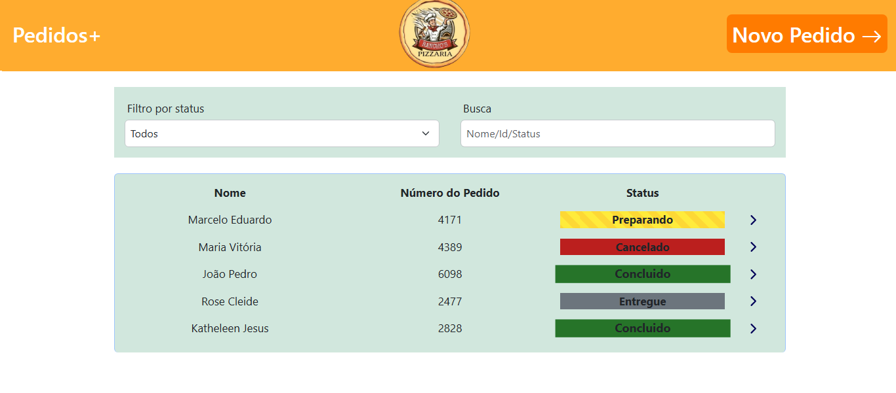
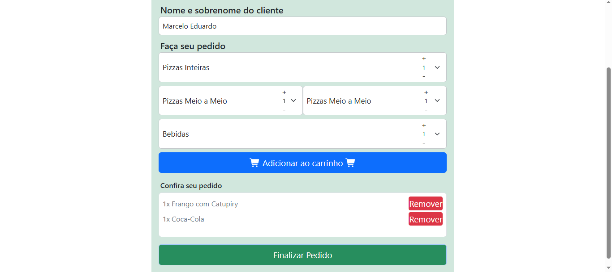
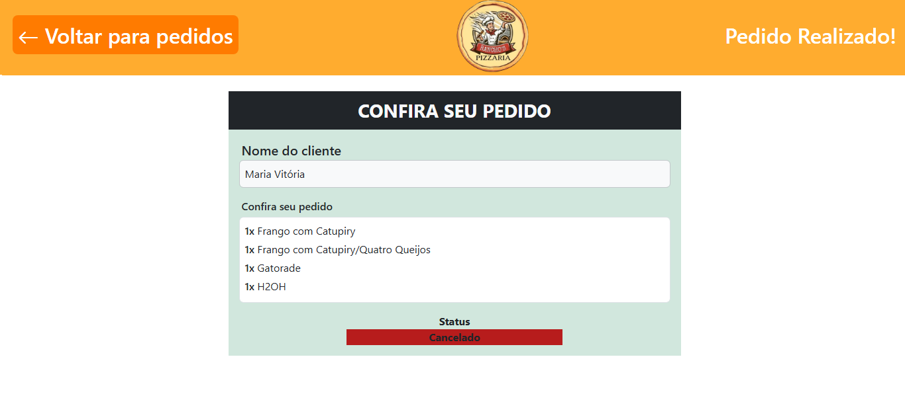
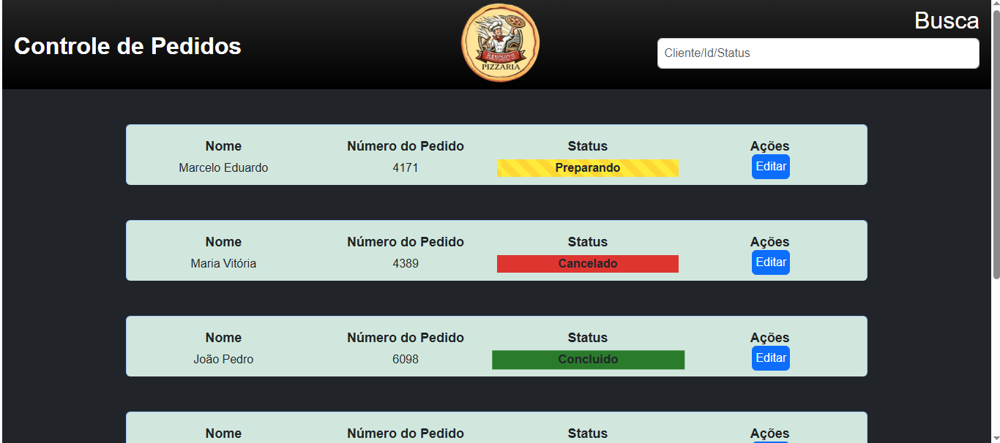

# 🍕 Order Management System — Angular + Node.js + MongoDB + Socket.io

## 📦 Full-Stack Order Management System with Real-Time Updates

This project is a complete **order management system** built to simulate a real-world food delivery environment, such as a pizzeria, restaurant, or fast-food business.

The application allows users to create orders, track their status, view detailed information, and receive real-time updates using **Socket.io**.

Built with **Angular** on the frontend and **Node.js + Express + MongoDB** on the backend, the project demonstrates full-stack integration, real-time communication, and a well-structured architecture between client, server, and database.

---

# 📑 PREVIEW






---

# 🌐 Live Demo

🟢 **Frontend:**
https://marcelusdev.github.io/order-management-system

🟢 **Backend (API) (JSON endpoint):**
https://order-management-system-xf7o.onrender.com/api/pedidos

---

# 🚀 Technologies

## 🧩 Frontend

* Angular (Standalone Components)
* TypeScript
* Bootstrap
* Custom CSS
* RxJS
* Socket.io Client
* FontAwesome

## ⚙️ Backend

* Node.js
* Express
* MongoDB Atlas
* Mongoose
* Socket.io Server
* CORS
* dotenv
* Render (Backend Deployment)

---

# 🧠 Features

## 👨‍🍳 Order Creation

* Customer registration with first and last name validation.
* Product and pizza flavor selection.
* Item quantity control.
* Shopping cart with automatic total calculation.
* Automatic order number generation.
* HTTP POST request to the backend.
* Error and success message handling.

---

## 🏠 Orders Dashboard

* Displays all received orders.
* Smart search by:

  * First name;
  * Last name;
  * Order number.
* Status filtering.
* Accent-insensitive search normalization.
* Automatic real-time updates.

---

## 🎛️ Control Panel

* View all orders.
* Update order status.
* Sends updates through HTTP PUT.
* Instant synchronization for every connected client.

---

## 📋 Order Details

* Complete order information.
* Dynamic status styling.
* Angular animations using `ngClass` and property bindings.

---

# 🔄 Real-Time Communication with Socket.io

Socket.io allows every connected client to receive updates instantly.

Whenever an order is created or updated:

1. The frontend sends the request to the backend.
2. The backend stores or updates the data in MongoDB.
3. The server emits an event through Socket.io.
4. Every connected client receives the update immediately.

No page refresh is required.

---

# 🧱 Project Structure

order-management-system/
│
├── backend/
│   ├── models/
│   │   └── Pedido.js
│   ├── index.js
│   ├── .env.example
│   └── package.json
│
├── screenshots/
│   ├── home.png
│   ├── client.png
│   ├── control.png
│   └── order.png
│
├── public/
│
├── src/
│   ├── app/
│   │   ├── pages/
│   │   │   ├── home/
│   │   │   ├── pedidos/
│   │   │   ├── controle/
│   │   │   └── pedido-detalhe/
│   │   ├── services/
│   │   ├── api.ts
│   │   ├── app.config.ts
│   │   └── app.routes.ts
│   │
│   ├── assets/
│   ├── index.html
│   ├── main.ts
│   └── styles.css
│
├── angular.json
├── package.json
└── README.md


---

# ⚙️ Installation

## Backend

Navigate to the backend folder:

```bash
cd backend
```

Install dependencies:

```bash
npm install
```

Create a `.env` file based on `.env.example`:

```env
MONGO_URI=your_mongodb_connection_string
PORT=3000
FRONTEND_URL=http://localhost:4200
```

Start the server:

```bash
npm start
```

The backend will run at:

```text
http://localhost:3000
```

---

## Frontend

From the project root:

```bash
npm install
```

Run the application:

```bash
ng serve
```

The frontend will run at:

```text
http://localhost:4200
```

---

# 🔐 Environment Variables

Sensitive information, such as the MongoDB connection string, is never stored directly in the source code.

The project uses:

* `.env` → Local private configuration.
* `.env.example` → Public template for project setup.

---

# 🌟 What I Learned

* Full-stack architecture separating frontend, backend, and database.
* Angular Standalone Components.
* Shared services for component communication.
* RxJS Observables.
* Real-time communication using Socket.io.
* Environment variable configuration.
* Backend deployment with Render.
* Git version control best practices.

---

# > ⚠️ **Note**
>
> This project uses the free tiers of **Render** and **MongoDB Atlas**.
> After long periods of inactivity, the backend may take a few moments to wake up on the first request.
>
> If the application does not respond immediately or the orders are not displayed at first, simply wait a few seconds and refresh the page. Once the services are active, the application works normally.

---

# 👨‍💻 Author

**Marcelo Eduardo**

Portfolio project focused on Full-Stack development, technology integration, and software engineering best practices.

GitHub: https://github.com/marcelusdev
LinkedIn: https://linkedin.com/in/marcelo-eduardo-660855424


<!--PORTUGUESE VERSION/ VERSÃO EM PORTUGUES-->


# 🍕 Sistema de Pedidos — Angular + Node.js + MongoDB + Socket.io

## 📦 Sistema Full-Stack com Atualização em Tempo Real

Este projeto é um sistema completo de gerenciamento de pedidos desenvolvido para simular o funcionamento de um ambiente real de delivery, como pizzarias, restaurantes ou lanchonetes.

A aplicação permite criar pedidos, acompanhar seu status, visualizar informações detalhadas e sincronizar todas as alterações em tempo real utilizando **Socket.io**.

Construído com **Angular no frontend** e **Node.js + Express + MongoDB** no backend, o projeto demonstra integração full-stack, comunicação em tempo real e uma arquitetura organizada entre cliente, servidor e banco de dados.

---

# 🌐 Demonstração

**Frontend:**
https://marcelusdev.github.io/order-management-system

**Backend (API) (JSON endpoint):**
https://order-management-system-xf7o.onrender.com/api/pedidos


---

# 🚀 Tecnologias Utilizadas

## 🧩 Frontend

* Angular (Standalone Components)
* TypeScript
* Bootstrap
* CSS personalizado
* RxJS
* Socket.io Client
* FontAwesome

## ⚙️ Backend

* Node.js
* Express
* MongoDB Atlas
* Mongoose
* Socket.io Server
* CORS
* dotenv
* Render (Deploy do Backend)

---

# 🧠 Funcionalidades

## 👨‍🍳 Criação de Pedidos

* Cadastro de cliente com validações de nome e sobrenome.
* Escolha de produtos e sabores.
* Controle de quantidade dos itens.
* Carrinho com cálculo automático.
* Geração automática do número do pedido.
* Envio dos dados para o backend via HTTP POST.
* Tratamento de mensagens de erro e sucesso.

---

## 🏠 Painel de Pedidos

* Listagem dos pedidos recebidos.
* Busca inteligente por:

  * Nome;
  * Sobrenome;
  * Número do pedido.
* Filtro por status.
* Normalização de textos para buscas com diferentes acentos.
* Atualização automática em tempo real.

---

## 🎛️ Painel de Controle

* Visualização completa dos pedidos.
* Alteração de status do pedido.
* Atualização enviada ao backend via HTTP PUT.
* Sincronização instantânea com todos os usuários conectados.

---

## 📋 Detalhes do Pedido

* Exibição completa das informações do pedido.
* Status com estilização dinâmica.
* Animações e alterações visuais utilizando Angular (`ngClass` e bindings).

---

# 🔄 Comunicação em Tempo Real com Socket.io

O Socket.io permite que todos os usuários conectados recebam alterações instantaneamente.

Sempre que um pedido é criado ou atualizado:

1. O frontend envia a requisição para o backend.
2. O backend salva ou atualiza os dados no MongoDB.
3. O servidor dispara um evento através do Socket.io.
4. Todos os clientes conectados recebem a atualização automaticamente.

Dessa forma, não é necessário atualizar a página manualmente.

---

# 🧱 Estrutura do Projeto

order-management-system/
│
├── backend/
│   ├── models/
│   │   └── Pedido.js
│   ├── index.js
│   ├── .env.example
│   └── package.json
│
├── screenshots/
│   ├── home.png
│   ├── client.png
│   ├── control.png
│   └── order.png
│
├── public/
│
├── src/
│   ├── app/
│   │   ├── pages/
│   │   │   ├── home/
│   │   │   ├── pedidos/
│   │   │   ├── controle/
│   │   │   └── pedido-detalhe/
│   │   ├── services/
│   │   ├── api.ts
│   │   ├── app.config.ts
│   │   └── app.routes.ts
│   │
│   ├── assets/
│   ├── index.html
│   ├── main.ts
│   └── styles.css
│
├── angular.json
├── package.json
└── README.md


# ⚙️ Instalação e Execução

## Backend

Entre na pasta:

```bash
cd backend
```

Instale as dependências:

```bash
npm install
```

Crie um arquivo `.env` baseado no `.env.example`:

```env
MONGO_URI=sua_string_de_conexao_mongodb
PORT=3000
FRONTEND_URL=http://localhost:4200
```

Execute:

```bash
npm start
```

O backend será iniciado em:

```text
http://localhost:3000
```

---

## Frontend

Na raiz do projeto:

```bash
npm install
```

Execute:

```bash
ng serve
```

O frontend será iniciado em:

```text
http://localhost:4200
```

---

# 🔐 Variáveis de Ambiente

Informações sensíveis, como a conexão com o MongoDB, não são armazenadas diretamente no código.

O projeto utiliza:

* `.env` → Arquivo local com informações privadas.
* `.env.example` → Modelo público para configuração do projeto.

---

# 🌟 Aprendizados e Boas Práticas

* Arquitetura full-stack separando frontend, backend e banco de dados.
* Utilização de Angular Standalone Components.
* Serviços compartilhados para comunicação entre componentes.
* Uso de RxJS Observables.
* Integração de WebSocket com Socket.io.
* Configuração de variáveis de ambiente.
* Deploy do backend utilizando Render.
* Boas práticas de versionamento com Git.

---
> ⚠️ **Observação**
>
> Este projeto utiliza os planos gratuitos do **Render** e do **MongoDB Atlas**.
> Após longos períodos de inatividade, o backend pode levar alguns instantes para ser reativado na primeira requisição.
>
> Caso a aplicação não responda imediatamente ou os pedidos não sejam exibidos no primeiro acesso, basta aguardar alguns segundos e atualizar a página. Assim que os serviços forem reativados, a aplicação funcionará normalmente.

---

# 👨‍💻 Autor

**Marcelo Eduardo**

Projeto desenvolvido para portfólio com foco em desenvolvimento Full-Stack, integração de tecnologias e boas práticas de programação.

GitHub: https://github.com/marcelusdev
LinkedIn: https://linkedin.com/in/marcelo-eduardo-660855424

